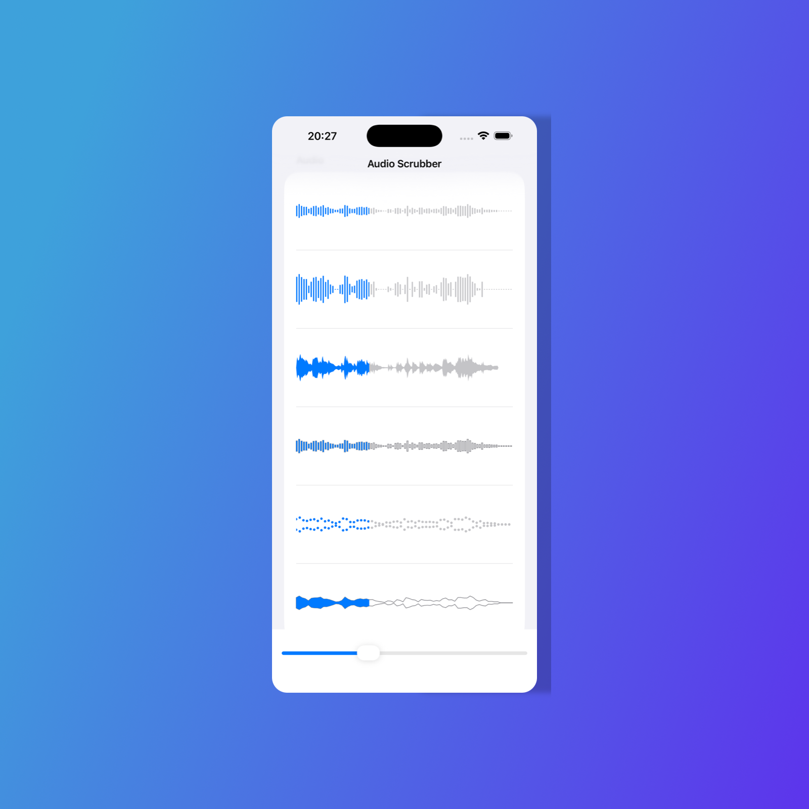

# WaveformScrubber


[](https://swiftpackageindex.com/lkora/WaveformScrubber)
[](https://swiftpackageindex.com/lkora/WaveformScrubber)

A highly customizable, performant, and lightweight SwiftUI view that displays an audio waveform and allows scrubbing through playback.



## Features

-   **Declarative & Swifty:** Built purely in SwiftUI for a modern, easy-to-use API.
-   **Highly Customizable:**
    -   **Pluggable Drawing System:** Use built-in drawers (`Bar`, `Line`, `BezierCurve`, etc.) or create your own by conforming to the `WaveformDrawing` protocol.
    -   **Flexible Styling:** Use the `.waveformScrubberStyle()` modifier to completely change the look and feel. Use solid colors, gradients, materials, or even combine fill and stroke styles.
    -   **Advanced Upsampling:** Intelligently interpolates data when the view is wider than the number of samples, ensuring a smooth, visually complete waveform. Choose from multiple strategies like `.smooth`, `.linear`, `.cosine`, `.hold`, or `.none`.
-   **Performant:**
    -   **Asynchronous Processing:** Audio is processed on a background thread to keep the UI responsive.
    -   **Optimized Downsampling:** Uses Apple's Accelerate framework (vDSP) for high-speed downsampling and upsampling.
    -   **Built-in Caching:** Processed waveform data is automatically cached in memory, ensuring seamless scrolling in lists and preventing redundant work.
-   **Responsive:** Automatically adapts and redraws the waveform when the view size changes, such as on device rotation or window resize.
-   **User-Friendly:** Supports scrubbing through the audio via a simple drag gesture.

## Requirements

-   iOS 16.0+
-   macOS 12.0+
-   watchOS 8.0+
-   visionOS 1.0+
-   Swift 5.9+

## Installation

You can add `WaveformScrubber` to your project using Swift Package Manager.

1.  In Xcode, open your project and navigate to **File > Add Packages...**
2.  Paste the repository URL: `https://github.com/lkora/WaveformScrubber.git`
3.  Click **Add Package**.

## Basic Usage

Import the package and use the `WaveformScrubber` view. The default appearance is a simple bar-style waveform.

```swift
import SwiftUI
import WaveformScrubber

struct BasicExampleView: View {
    // URL to your audio file
    private let audioURL = Bundle.main.url(forResource: "example", withExtension: "mp3")!

    @State private var progress: CGFloat = 0.25

    var body: some View {
        VStack {
            Text("Playback Progress: \(Int(progress * 100))%")
            
            WaveformScrubber(
                drawer: BarDrawer(), // The default bar-style drawer
                url: audioURL,
                progress: $progress
            )
            .frame(height: 100)
            .padding()
            
            // Control the progress from outside
            Slider(value: $progress)
                .padding()
        }
    }
}
```

## Advanced Customization

`WaveformScrubber` offers two powerful customization layers: **Drawers** (the shape of the waveform) and **Styles** (the appearance/color).

### 1. Choosing a Drawer

A "Drawer" defines the geometric shape of the waveform. You can choose from several built-in drawers and configure them.

#### BarDrawer
The classic bar graph style.
```swift
WaveformScrubber(
    drawer: BarDrawer(config: .init(barWidth: 4, spacing: 5, minBarHeight: 4, cornerRadius: 2)),
    url: audioURL,
    progress: $progress
)
```

#### LineDrawer
A solid, filled line shape, like in many popular audio apps.
```swift
WaveformScrubber(
    drawer: LineDrawer(config: .init(inverted: true)), // Create a "cutout" effect
    url: audioURL,
    progress: $progress
)
```

#### BezierCurveDrawer
A smooth, organic curve for a modern look.
```swift
WaveformScrubber(
    drawer: BezierCurveDrawer(config: .init(curviness: 0.8, pixelsPerSample: 4)),
    url: audioURL,
    progress: $progress
)
```


### 2. Configuring a Drawer (Upsampling)

When the waveform view is wider than the number of available samples, the scrubber intelligently **upsamples** the data to create a smooth, continuous look. You can control this behavior via the `upsampleStrategy` in each drawer's configuration.

```swift
VStack {
    Text("Smooth Interpolation (Default)")
    WaveformScrubber(
        drawer: BarDrawer(upsampleStrategy: .smooth),
        url: shortAudioURL,
        progress: $progress
    )
    
    Text("Hold Interpolation (Blocky)")
    WaveformScrubber(
        drawer: BarDrawer(upsampleStrategy: .hold),
        url: shortAudioURL,
        progress: $progress
    )
    
    Text("No Interpolation (Gaps)")
    WaveformScrubber(
        drawer: BarDrawer(upsampleStrategy: .none),
        url: shortAudioURL,
        progress: $progress
    )
}
```

### 3. Styling the Waveform

Use the `.waveformScrubberStyle()` modifier to change the appearance. The default style fills the active and inactive parts of the waveform.

#### Using Solid Colors
```swift
WaveformScrubber(drawer: BarDrawer(), url: audioURL, progress: $progress)
    .waveformScrubberStyle(
        DefaultWaveformScrubberStyle(
            active: .purple,
            inactive: .purple.opacity(0.3)
        )
    )
```

#### Using Gradients and Other ShapeStyles
You can use any `ShapeStyle`, including linear gradients, radial gradients, or materials.
```swift
let activeGradient = LinearGradient(colors: [.cyan, .blue], startPoint: .top, endPoint: .bottom)

WaveformScrubber(drawer: BezierCurveDrawer(), url: audioURL, progress: $progress)
    .waveformScrubberStyle(
        DefaultWaveformScrubberStyle(
            active: activeGradient,
            inactive: Color.gray.opacity(0.25)
        )
    )
```

#### Stroking the Waveform
Use the `StrokeWaveformScrubberStyle` to draw an outline instead of a filled shape. This is great for the `LineDrawer` or `BezierCurveDrawer`.
```swift
WaveformScrubber(drawer: LineDrawer(), url: audioURL, progress: $progress)
    .waveformScrubberStyle(
        StrokeWaveformScrubberStyle(style: .orange, lineWidth: 2)
    )
```

### Creating Custom Drawers and Styles

For more control, you can create your own drawers and styles by conforming to the `WaveformDrawing` and `WaveformScrubberStyle` protocols, respectively. This allows you full freedom to tailor this package to your app's design without forking it.

## Callbacks

`WaveformScrubber` provides closures to react to events.

```swift
WaveformScrubber(
    drawer: BarDrawer(),
    url: audioURL,
    progress: $progress,
    onInfoLoaded: { audioInfo in
        // Fired once the audio file's metadata is available.
        print("Audio duration: \(audioInfo.duration)")
    },
    onGestureActive: { isDragging in
        // Fired when the user starts or stops dragging the waveform.
        if isDragging {
            print("User is scrubbing.")
        } else {
            print("User finished scrubbing.")
        }
    }
)
```
## Documentation

For more detailed documentation, check out the [documentation](https://swiftpackageindex.com/lkora/WaveformScrubber/main/documentation/waveformscrubber) page hosted on Swift Package Index.

## Swift Package Manager

In your `Package.swift` Swift Package Manager manifest, add the following dependency to your `dependencies` argument:

```swift
.package(url: "https://github.com/lkora/WaveformScrubber.git", branch: "main"),
```

Add the dependency to any targets you've declared in your manifest:

```swift
.target(name: "MyTarget", dependencies: ["WaveformScrubber"]),
```
